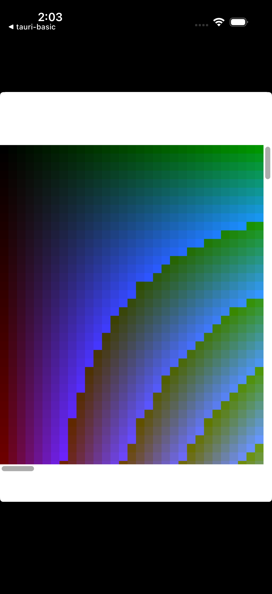
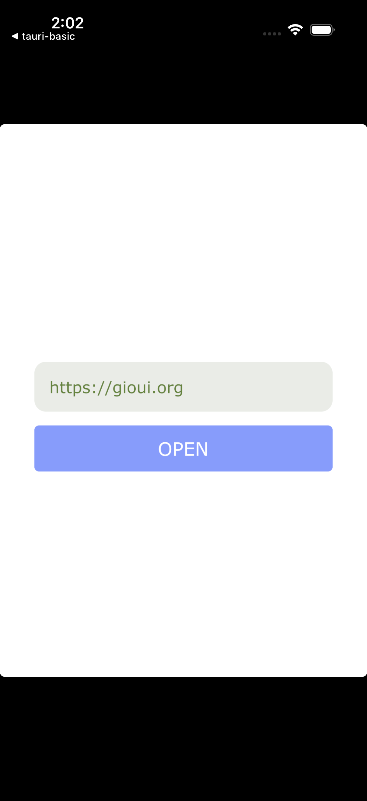
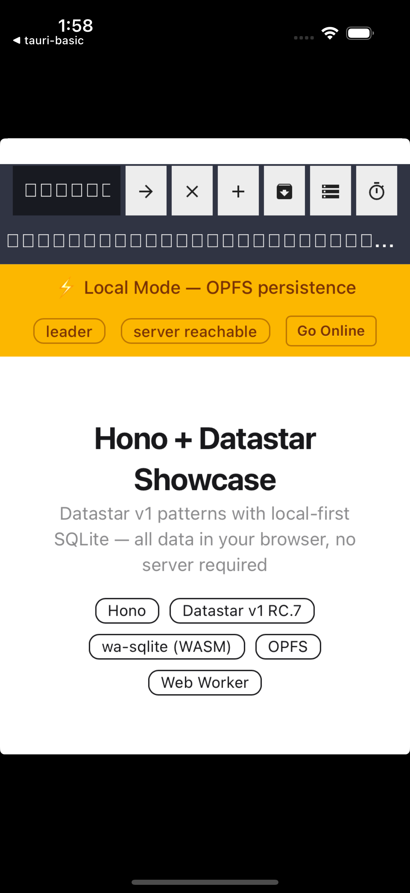
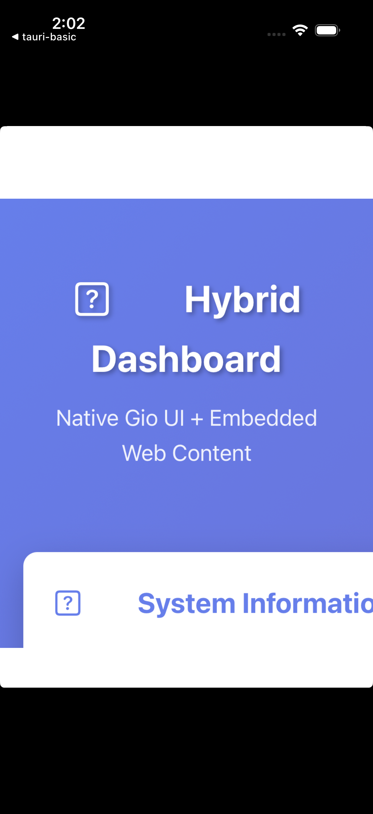

# Examples

Five examples covering Gio mobile apps and Tauri desktop/mobile apps.

## Gio Examples (iOS Simulator)

All screenshots taken on iPhone 16 Pro simulator (iOS 18.3, Apple Silicon).

### gio-basic

Color grid rendering with `gioui.org` and `gioui.org/x/component`.



### gio-plugin-hyperlink

Open URLs via `gio-plugins/hyperlink`. Type a URL and tap OPEN.



### gio-plugin-webviewer

Full browser UI with tabs via `gio-plugins/webviewer`.



### hybrid-dashboard

Embedded HTTP server + WebView + deep linking. Native Gio window hosts a webview serving content from an embedded Go HTTP server.



## Tauri Example

| Example | Framework | What it shows |
|---|---|---|
| **tauri-basic** | Tauri v2 | Webview app — iOS sim, macOS, Windows via UTM |

## Running Gio Examples

From the repo root (with utm-dev built):

```bash
# iOS simulator (Apple Silicon — patched Metal shaders for arm64 sim)
utm-dev gio run ios-simulator examples/gio-basic
utm-dev gio run ios-simulator examples/hybrid-dashboard

# macOS
utm-dev gio run macos examples/gio-basic

# Android (device or emulator must be connected)
utm-dev gio run android examples/gio-basic

# Build only (no launch)
utm-dev gio build ios-simulator examples/gio-basic
utm-dev gio build macos examples/gio-basic
utm-dev gio build android examples/gio-basic
```

From an example directory (with utm-dev installed via plat-trunk):

```bash
cd examples/gio-basic
mise run ios-simulator
mise run macos
mise run android
```

Add `--force` to rebuild even if cached.

## Running Tauri Examples

```bash
# iOS simulator (no signing cert needed)
utm-dev tauri build ios examples/tauri-basic

# macOS desktop
utm-dev tauri build macos examples/tauri-basic

# Windows via UTM VM
utm-dev tauri build windows examples/tauri-basic
```

## Gio Versions

Pinned to avoid panics (never use `@latest`):

```
gioui.org                             v0.9.1-0.20251215212054-7bcb315ee174
gioui.org/x                           v0.9.0
github.com/gioui-plugins/gio-plugins  v0.9.2
```

All Gio examples use `go 1.25.0`.

## iOS Simulator on Apple Silicon

Gio's shader module (`gioui.org/shader`) selects Metal shader variants based on `runtime.GOARCH`. On Apple Silicon, arm64 simulator builds get iOS *device* shaders instead of *simulator* shaders, causing Metal compilation failures at runtime.

utm-dev works around this by vendoring and patching the shader selection during iOS simulator builds so that arm64 always gets simulator Metal shaders. This happens automatically — no manual steps needed.
