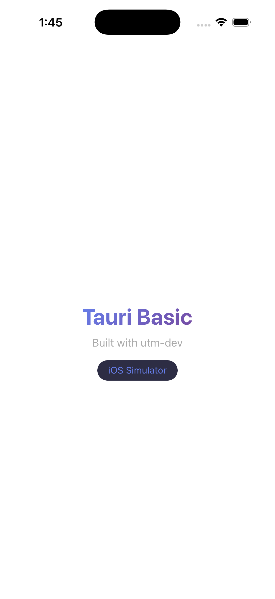

# tauri-basic

Minimal Tauri v2 example with embedded frontend. Builds and runs on iOS Simulator without a signing cert.

## iOS Simulator (no cert needed)

```bash
# Build — auto-detects no cert, targets simulator
utm-dev tauri build ios .

# Install on booted simulator
utm-dev ios install src-tauri/gen/apple/build/arm64-sim/tauri-basic.app

# Launch
utm-dev ios launch dev.example.tauri-basic

# Screenshot
utm-dev ios screenshot screenshot.png
```

## Desktop

```bash
# Dev mode (hot reload)
utm-dev tauri dev .

# Build macOS bundle
utm-dev tauri build macos .

# Windows via UTM VM
utm-dev tauri build windows .
```

## Prerequisites

Installed automatically by `utm-dev tauri setup`:
- Rust + `cargo-tauri`
- Xcode + iOS Simulator runtime
- CocoaPods (iOS)
- `xcodegen` (iOS)

## Screenshot


